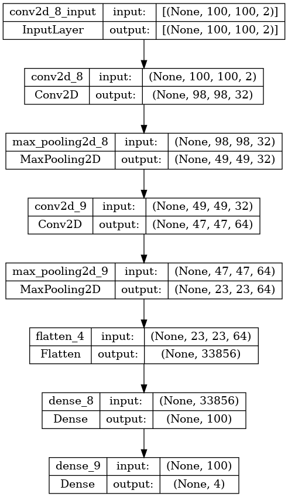

# alma-dnn/folding

Runs with files generated via <https://github.com/roboticslab-uc3m/alma-dataset>. You can directly run against <https://doi.org/10.5281/zenodo.14864392>.

## cloth2d_dnn.py



### Build

Best build via docker:

```bash
./docker/build.sh
```

### Run

Best run via docker:

```bash
./docker/run.sh
```
